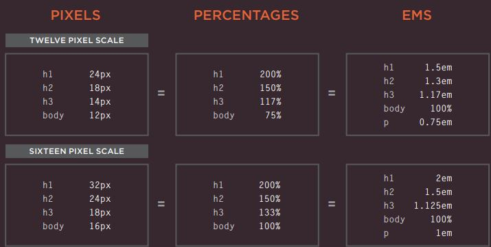

# Html
## Images
* The  element is used to add images to a 
web page.
* You must always specify a src attribute to indicate the 
source of an image and an alt attribute to describe the 
content of an image.
* Photographs are best saved as JPEGs; illustrations or 
logos that use flat colors are better saved as GIFs.
# css
* CSS3 introduces an entirely new and intuitive 
way to specify colors using :
1. **Hue** 
Hue is the colloquial idea of 
color. In HSL colors, hue is often 
represented as a color circle 
where the angle represents the 
color, although it may also be 
shown as a slider with values 
from 0 to 360.
2. **Saturation** 
Saturation is the amount of 
gray in a color. Saturation is 
represented as a percentage. 
100% is full saturation and 0% 
is a shade of gray.
3. **Lightness values**
Lightness is the amount of 
white (lightness) or black 
(darkness) in a color. Lightness 
is represented as a percentage. 
0% lightness is black, 100% 
lightness is white, and 50% 
lightness is normal.

* Typeface Terminology
1. Serif 
Serif fonts have extra details on 
the ends of the main strokes of 
the letters. These details are 
known as serifs.
2. Sans-Serif
Sans-serif fonts have straight 
ends to letters, and therefore 
have a much cleaner design.

3. Monospace
Every letter in a monospace (or 
fixed-width) font is the same 
width. (Non-monospace fonts 
have different widths.)

* Units of Type Size\

 

 * **JPEG**is a lossy compression specification that takes advantage of human perception. It can achieve compression ratios of 1:10 without any perceivable difference in quality. Beyond this, the compression artefacts become more prominent. Because JPEG compression works by averaging out colours of nearby pixels , JPEG images are best suited for photographs and paintings of natural scenes where the variations in colour and intensity are smooth. However, if an image contains text or lines, where a sharp contrast between adjacent pixels is desired to highlight the proper shape, this lossy compression technique does not yield good results.

 * **PNG** is a lossless image format using DEFLATE compression. No data is lost during compression and no compression artefacts are introduced in the image. For this reason, a PNG image would retain higher quality than an image than JPEG and would look a lot sharper, it would also occupy more space on the disk. This makes it unsuitable for storing or transferring high-resolution digital photographs but a great choice for images with text, logos and shapes with sharp edges.
 
  * **GIF** is also a lossless image format that uses LZW compression algorithm. It was favoured over PNG for simple graphics in websites in its early days because the support of PNG was still growing. Given that PNG is now supported across all major devices and that PNG compression is about 5–25% better than GIF compression, GIF images are now mainly used only if the image contains animations.

