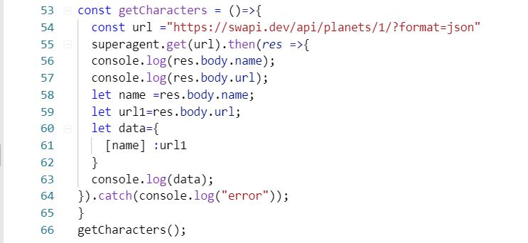
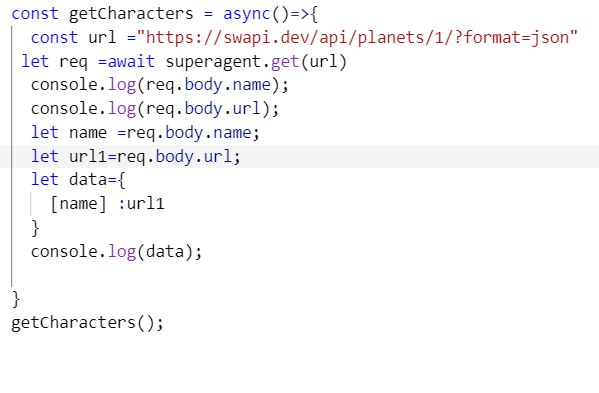

# Review, Research, and Discussion

1. Describe (in plain English) what Array.map() does?
Array.map() is used to create a new array by calling a function on each element of the passed array.

2. Describe (in plain English) what Array.reduce() does?
Array.reduce iterates over the array and invokes the callback on each element. The difference is that instead of returning an array of equal size containing whatever was returned by the callback in each element, it returns whatever the final invocation of the callback returns.

3. Provide code snippets showing how to use superagent() to fetch data from a URL and log the result
With normal Promise .then() syntax?

* Again with async / await syntax ?

4. Explain promises as though you were mentoring a Code 301 level student?

JavaScript is single threaded, meaning that two bits of script cannot run at the same time; they have to run one after another. A Promise is an object that represents the eventual completion (or failure) of an asynchronous operation, and its resulting value.

5. Are all callback functions considered to be Asynchronous? Why or Why Not?

its not asynchronous,It iterates over each item and calls the function once per item.

### Resource
* [mdn](https://developer.mozilla.org/en-US/).
